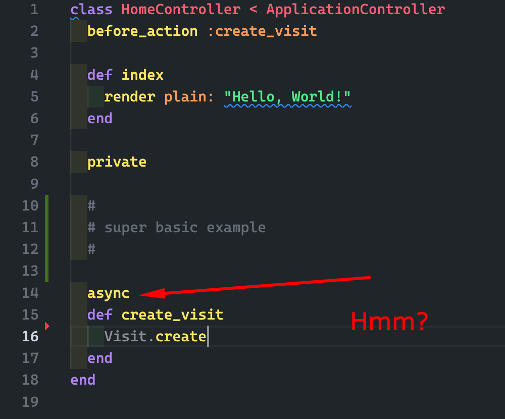

# AsyncMagic



AsyncMagic is a lightweight Ruby gem that makes it effortless to add asynchronous method execution to your Ruby classes. With a simple `async` declaration, your methods will execute in a managed thread pool, providing non-blocking operations while maintaining clean, readable code.

Inspired by Rails [`async`](https://github.com/rails/rails/blob/9ffd264e016ee5501b19286c2f48d952e910e96c/activejob/lib/active_job/queue_adapters/async_adapter.rb#L89) methods.

## Features

- ✨ Simple `async` declaration for asynchronous methods
- 🧵 Managed thread pool with configurable options
- 🚂 Rails integration with ActiveRecord support
- 🎯 Support for both instance and class methods
- 📝 Built-in error logging
- ⚡ Non-blocking execution with Future objects

## Installation

Add this line to your application's Gemfile:

```ruby
  gem 'async_magic'
```

```bash
  $ bundle install
```

## Usage

By default, AsyncMagic will include the methods in all Objects. But you can configure it to include in specific objects (ActiveRecord models, etc.) or manually include it in your classes.

See the [Configuration](./lib/async_magic.rb) for more details.

```ruby
class UserHeavyLogic
  async
  def send_welcome_email(user)
    # ... your code
  end

  async
  def self.batch_process(users)
    # ... your code
  end
end

# or

class UsersController < ApplicationController
  def index
    # ... your code
    log_user_activity
  end

  private

  async
  def log_user_activity
    # ... your code
  end
end
```

## More examples

- check if completed
- get the result

```ruby
  mailer = UserMailer.new
  future = mailer.send_welcome_email(user)
  # Check if completed
  future.completed?
  # Get the result (blocks until complete)
  result = future.value
```

- initializer to configure the thread pool

```ruby
  # config/initializers/async_magic.rb

  AsyncMagic.configure do |config|
    # Include in all ActiveRecord models
    config.include_in = :active_record
    # Or include globally (available everywhere)
    # config.include_in = :global
    # Or disable auto-inclusion
    # config.include_in = nil
  end
```

- configure the thread pool

```ruby
AsyncMagic.configure do |config|
  config.executor_options = {
    min_threads: 10, # Minimum number of threads
    max_threads: 50, # Maximum number of threads
    auto_terminate: true, # Automatically terminate threads
    idletime: 60, # Thread idle time (seconds)
    max_queue: 0, # Unlimited queue size
    fallback_policy: :caller_runs # What to do when queue is full
  }
  end
```

- error handling
```ruby
  class MyService
    include AsyncMagic

    async
    def risky_operation
      # If this raises an error, it will be logged
      raise "Something went wrong!"
    end
  end
```

The error will be logged and the future will contain the error

```ruby
  future = MyService.new.risky_operation
  future.rejected? # => true
  future.reason # => #<RuntimeError: Something went wrong!>
```

- manually include AsyncMagic

```ruby
  class DataProcessor
    include AsyncMagic

    async
    def process_data(data)
    # Heavy processing here
    end
  end
```

```ruby
  processor = DataProcessor.new
  future = processor.process_data(large_dataset)
  # Wait for completion with timeout
  if future.wait(5) # waits up to 5 seconds
    result = future.value
  else
    puts "Processing is taking too long!"
  end
```

```ruby
  AsyncMagic.shutdown # Waits up to 5 seconds for completion
```

## Code style

Just use:

```bash
  $ bundle exec standardrb
  # or
  $ bundle exec standardrb --fix
```

## Contributing

You are welcome to contribute to this gem.

## License

This gem is available as open source under the terms of the [MIT License](https://opensource.org/licenses/MIT).

## Credits

Thanks AI to help me write this gem faster :)
